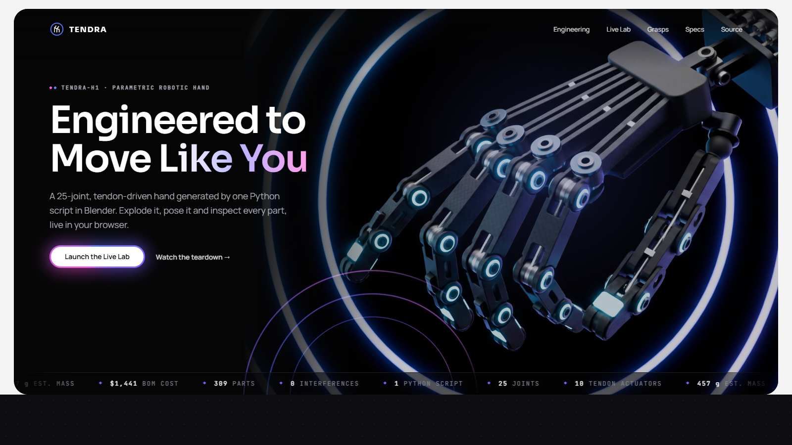
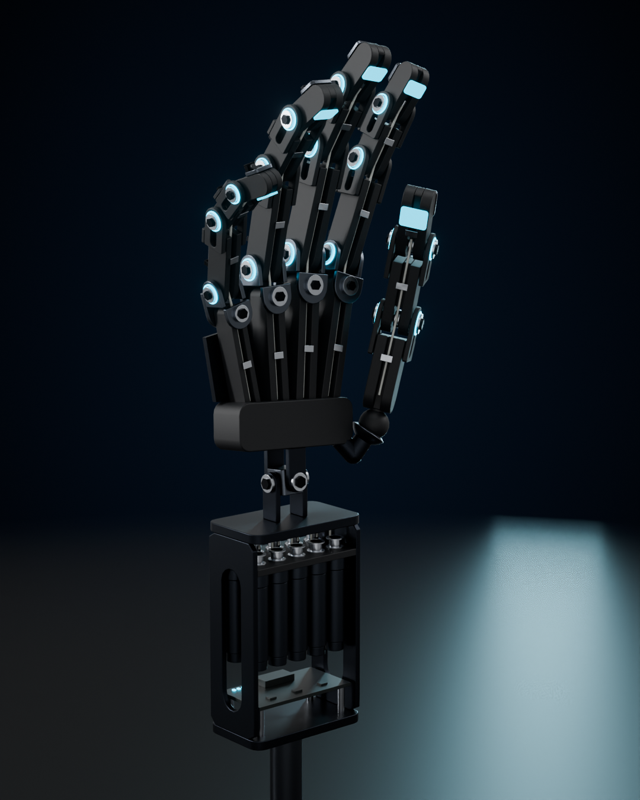
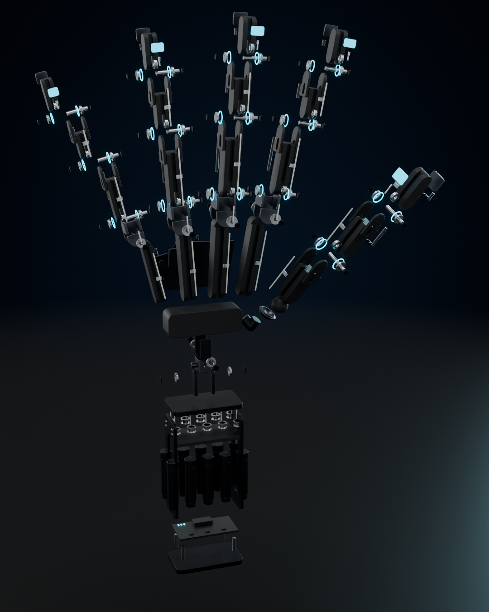
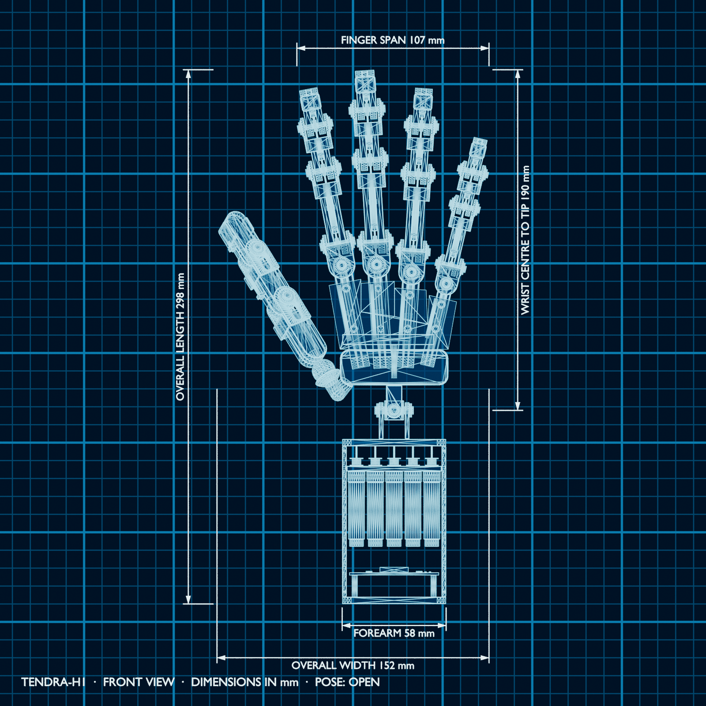

# TENDRA-H1 — Parametric Robotic Hand

A fully articulated, tendon-driven robotic hand generated **entirely from one Python script** in Blender, with an interactive exploded view, part callouts, a posable rig with grasp presets, an auto-generated BOM and mass and cost estimate, and a browser viewer you can explode and pose.

**Live demo:** [Live Demo](https://aymankhayat.github.io/tendra-h1-robotic-hand/)



| Assembled | Exploded | Blueprint |
|---|---|---|
|  |  |  |

## Features

- **Generator, not a model**: hand scale, finger length ratio, palm width and finger count all rebuild the hand. The repo includes a 3-finger variant built by the same script ([render](output/renders/07_variant_3finger_hero_4x5.png)).
- **Exposed-skeleton mechanics**: U-channel CF-nylon links with clevis forks, Ø3 mm pins, flanged bearings, screws, grooved tendon pulleys, retainer straps, wiring conduits and fingertip tactile pads.
- **Real thumb opposition**: a separate CMC ball-and-socket with its own joint axes. The opposition mapping was found by numerical search, not by eye ([`tools/tune_thumb.py`](tools/tune_thumb.py)).
- **Posable rig**: 27 bones with drivers, human range-of-motion limits (hyperextension capped at 5–15°), and six grasp presets from robotic-grasp taxonomy: Open, Fist, Pinch, Point, Power Grip, OK Sign.
- **Exploded view driven by hierarchy and joint axes**: distal parts travel furthest along each finger, while pins, bearings and screws slide out along their hinge axis.
- **In-Blender UI panel** (N-panel → TENDRA): Explode Factor, Show Labels, Technical (blueprint) View, curl sliders, preset dropdown, click-to-isolate inspection with spec callout, and one-click Regenerate.
- **Engineering outputs**: [BOM](output/bom.md) with volume × density masses, a prototype cost estimate and a one-page [datasheet](output/TENDRA-H1_datasheet.pdf).
- **Automated verification**: BVH interference and floating-part checks at rest and in every grasp. The default hand has 0 interferences and is a single connected assembly ([`verification.json`](output/verification.json)). The 3-finger variant is clean except its *Point* preset, whose thumb values were tuned for four fingers ([`verification_variant.json`](output/verification_variant.json)).
- **Web viewer + landing page**: a three.js "Live Lab" inside a portfolio site with film grain, glowing rings and an iridescent CTA. Every rig control is baked into its own glTF animation clip, so the sliders, presets, blueprint mode and click-to-inspect all work in the browser.
- **AI concept imagery**: hero, lab and exploded "drama" shots generated with [Higgsfield](https://higgsfield.ai) (Nano Banana 2), using the Cycles renders as references. They are captioned as concept images on the site.

| | |
|---|---|
| Joints / actuators | 25 / 10 (under-actuated, tendon-coupled) |
| Estimated mass | ≈ 457 g |
| Component cost | ≈ $1,440 (prototype quantities, excludes labour) |
| Parts | 309 (64 unique line items) |

## Tech stack

Blender 5.2 (bpy, bmesh, mathutils BVH) · Python 3.11 · Cycles and EEVEE · glTF 2.0 · three.js r160 · HTML/CSS · Higgsfield CLI

## Getting started

Requires [Blender 5.2+](https://www.blender.org/download/). There are no other dependencies.

```bash
# Build the hand (reports + .blend)
blender -b --factory-startup -P hand_generator.py -- --save output/tendra_h1.blend --reports output

# A different hand from the same generator
blender -b --factory-startup -P hand_generator.py -- --fingers 3 --finger-length 1.35 --palm-width 72 --scale 1.12

# Full pipeline: verify, render stills/poses/orthographics, variant, save, GLB
blender -b --factory-startup -P pipeline.py -- --steps all --samples 64

# Showcase animation (explode → reassemble → grip), 16:9 or 4:5
blender -b --factory-startup -P pipeline.py -- --steps anim --anim_format 16x9

# Datasheet, web assets and the site (web/index.html)
python tools/build_spec_sheet.py
blender -b --factory-startup -P tools/export_web_assets.py
python tools/build_web.py
```

In the Blender GUI, open `hand_generator.py` in the Scripting tab and click **Run Script**. Then press `N` in the 3D viewport and open the **TENDRA** tab. When you open the saved `.blend`, allow Python scripts so the panel and click-to-isolate handler register.

No environment variables are required.

## How it works

| File | Role |
|---|---|
| `hand_generator.py` | Geometry, materials, armature, drivers, exploded view, labels, studio, BOM and the UI panel module |
| `pipeline.py` | Headless production: verification, renders, orthographic dimensioning, variant, GLB export, animation |
| `tools/tune_thumb.py`, `tools/tune_presets.py` | Forward-kinematics search for thumb opposition and collision-free grasp presets |
| `web/template.html` → `web/index.html` | Landing page + three.js Live Lab (the GLB is embedded, so it works from any static host) |
| `docs/higgsfield_prompts.md` | Prompts used for the AI concept imagery |

**Why drivers don't go to the web directly:** Blender custom-property drivers are not part of glTF. The exporter bakes each control (explode, each finger curl, spread, cup, thumb, wrist) into a separate NLA track over frames 0–60. The viewer strips the static tracks Blender samples into every clip, then sets each clip's time from its slider, so the controls combine independently.

## License

MIT
